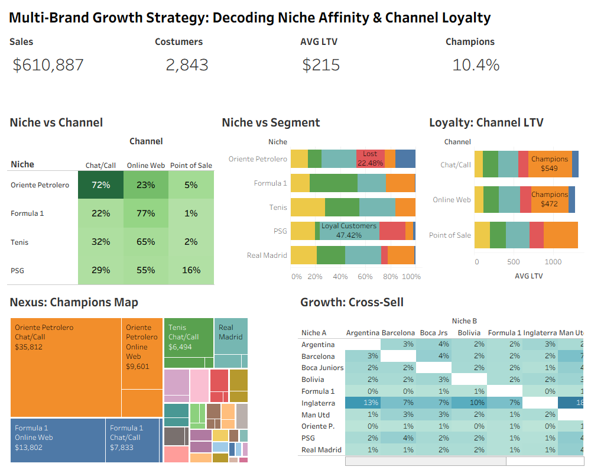

# Multi-Brand Growth Strategy: Decoding Niche Affinity & Channel Loyalty

**Project Role:** Senior Data Analyst | **Tools:** SQL (MariaDB), Tableau

> **[📄 Read the Executive Report (Key Insights & Strategy)](docs/executive_report.md)**

## 🚀 The Business Problem
A vertically integrated retail group with 4 distinct brands was struggling to optimize its marketing budget.
*   **The Model:** **Hybrid Just-in-Time (JIT) Manufacturing.** Unlike simple POD, the business managed owned inventory of premium blanks (Bella+Canvas), optimizing margins by balancing "Pre-Cut Stock" for retail vs. "On-Demand Assembly" for online orders.
*   **The Conflict:** The business was torn between a **Volume-Based Acquisition** strategy (Formula 1 sales) and a **Value-Based Retention** strategy (Oriente Petrolero loyalty).
*   **The Objective:** Audit the customer base to pivot from **Customer Volume** to **Customer Equity** by identifying high-conversion niche and channel corridors.

## 💡 The Solution: A Unified Customer Equity Engine
I unified siloed data from 4 WooCommerce stores into a single SQL Analytical Engine to audit the business across 3 dimensions: **Interest (Niche)**, **Channel (Source)**, and **Value (RFM Segment)**.

### 1. Key Insights Uncovered (The Audit Results)

#### A. Niche Strategy: Acquisition vs. Loyalty
*   **Formula 1:** Drives high acquisition volume (70% Web) but with lower retention. It is a massive **New Customer Funnel** that requires optimized remarketing.
*   **Oriente Petrolero:** The **Loyalty Engine**. Attracts **49% of ALL Champions**. It is the primary driver of recursive profit.
*   **Real Madrid:** High-affinity niche with a **2.5:1 Retention Ratio**.

#### B. Channel Strategy: The ROI of "High Touch"
*   **Chat/Call (WhatsApp, FB Messenger, IG DM, TikTok DM):** **28%** of customers are Champions. Assisted sales generate **3x more Value per Customer** than pure web transactions.
*   **Web Checkout:** The primary "Volume Gate" for new acquisition, but secondary for long-term loyalty management.

#### C. Growth Opportunities (The "Player Effect")
*   **Cross-Sell Win:** Buyers of **Barcelona** have a **12% probability** of buying **PSG** (Messi/Neymar Effect).
*   **Cross-Sell Win:** **33%** of "England" buyers also purchase **Manchester United** (Country-Club correlation).

---

## 📂 Repository Structure
*   **`/dashboards`**: The final Tableau Workbook (`niche_affinity_channel_loyalty.twbx`) visualizing the 5 Strategic Insights.
*   **`/docs`**: Executive Reports & Strategic Frameworks.
    *   `executive_report.md`: The high-level business findings (Start Here).
    *   `dashboard_wireframe.md`: The design spec for the visualization.
*   **`/sql`**: The Analytical Engine (7-Layer View Architecture).
    *   `01-05`: Data Unification & Staging.
    *   `06`: The RFM Segmentation Logic (Absolute Thresholds).
    *   `07`: The Strategic Reporting Layer.
*   **`/data`**: The final datasets used (`tableau_dataset.csv` & `affinity_matrix.csv`).

---

## 🛠️ Methodology & Technical Stack
*   **Data Engineering:** Built a Star Schema in MariaDB to unify 50,000+ transaction lines.
*   **Data Quality:** Identifying and filtering "Ghost Champions" (Anonymous Tax-ID transactions) to prevent biasing the loyalty model.
*   **Analytics:** Used SQL Window Functions (`NTILE`) for initial scoring, then refined to **Absolute Logic** to correct for "One-Time Buyer" bias in the F1 niche.
*   **Visualization:** Tableau Dashboard focusing on "Share of Champions" rather than just Volume.

---
*This project is part of my professional portfolio demonstrating Data Analysis, SQL Engineering, and Strategic Business Intelligence.*
