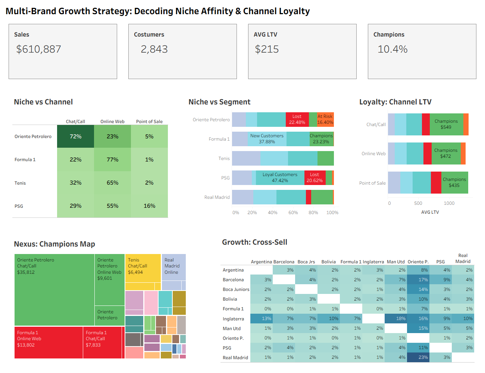

# Decoding Niche Affinity & Channel Loyalty

> **Interactive Dashboard:** [View Live on Tableau Public](https://public.tableau.com/views/Customer_Equity_Audit_v1/Dashboard1)

| Metric | Finding |
| :--- | :--- |
| **Total Customers Analyzed** | ~2,600 unique profiles across 4 brands |
| **Champion Concentration** | 49% of all Champions belong to one niche: Oriente Petrolero |
| **Chat vs. Web LTV** | Chat-assisted sales generate **3x more value** per customer than Web |
| **Top Cross-Sell Signal** | Oriente buyers → Real Madrid at **35.2% probability** |

📄 **[Read the full Executive Report — Customer Equity Audit & Strategic Recommendations →](docs/executive_report.md)**

---

## The Business Problem

The Rabbona Group operated 4 WooCommerce stores (Pasión Albiverde, Rabbona, Victus, Nebula) targeting distinct niches across local football, global football, motorsport, and pop culture. Despite steady growth, marketing budget was being allocated by **volume** — not by **customer value**. The result: the highest-loyalty niche was being under-invested, while high-churn niches were over-funded.

**Objective:** Audit the customer base across 3 dimensions — Niche Affinity, Channel Loyalty, and RFM Value — to reallocate budget toward the highest-equity segments.

---

## Key Findings

### A. Niche Strategy: Acquisition vs. Loyalty

- **Oriente Petrolero:** Drives 49% of all Champions despite not having the highest order volume. This is the retention engine of the business — the niche that builds real lifetime value.
- **Formula 1:** High acquisition volume (70% via Web) but low retention. Valuable as a top-of-funnel entry point, not as a loyalty anchor.
- **Real Madrid:** 2.5:1 retention ratio — a quiet, high-affinity niche that punches above its weight.

### B. Channel Audit: The ROI of "High Touch"

- **Chat (WhatsApp / FB Messenger / Instagram DM / TikTok DM):** 28% of buyers in this channel are Champions. Assisted sales generate **3x more lifetime value** per customer than self-serve web transactions.
- **Web Checkout:** Highest acquisition volume but only 1.2% Champion conversion rate. Critical for growth, secondary for loyalty.

### C. Cross-Sell Probability Matrix

| Trigger Purchase | Next Likely Purchase | Probability | The Signal |
| :--- | :--- | :--- | :--- |
| **Oriente Petrolero** | Real Madrid | **35.2%** | Local pride + European giant affinity |
| **England** | Manchester United | **33.3%** | Country-Club correlation |
| **Barcelona** | PSG | **12.3%** | The Messi/Neymar player effect |
| **Oriente Petrolero** | Bolivia National Team | **9.2%** | Patriotic double-loyalty |

---

## Technical Architecture

- **Data Unification:** 4 isolated WooCommerce databases consolidated into a single MariaDB Star Schema (~5,600 orders, ~9,000 order line items across 2018–2023)
- **4-Stage SQL Analytical Pipeline:** Staging & Unification → Absolute RFM Engine → Affinity Matrix → Tableau Reporting
- **Absolute RFM Logic:** Business-threshold segmentation rather than relative `NTILE` percentiles, preventing high-churn niches (F1) from diluting the Champion definition
- **PII Governance:** All customer identifiers (email, phone) anonymized via SHA-256 hashing before entering the analytical layer
- **"Ghost Champions" Filter:** POS anonymous Tax-ID transactions identified and excluded to prevent loyalty model bias

---

## Repository Structure

- `sql/`: 4-stage SQL analytical engine (Staging through Strategic Reporting)
- `data/`: Final CSV datasets consumed by the Tableau workbook
- `docs/executive_report.md`: Full strategic findings and recommendations
- `docs/data_quality_report.md`: Data governance, integrity audit and cleaning methodology
- `assets/`: Exported dashboard visual and individual analytical sheets
- `dashboards/`: Packaged Tableau workbook (`.twbx`)

---

*This project is part of a professional Data Analysis portfolio demonstrating SQL Engineering, Customer Segmentation, and Strategic Business Intelligence.*
