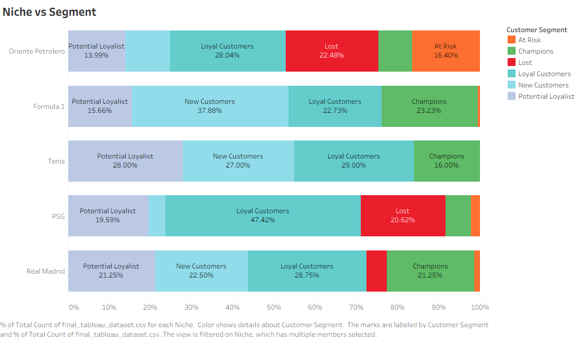
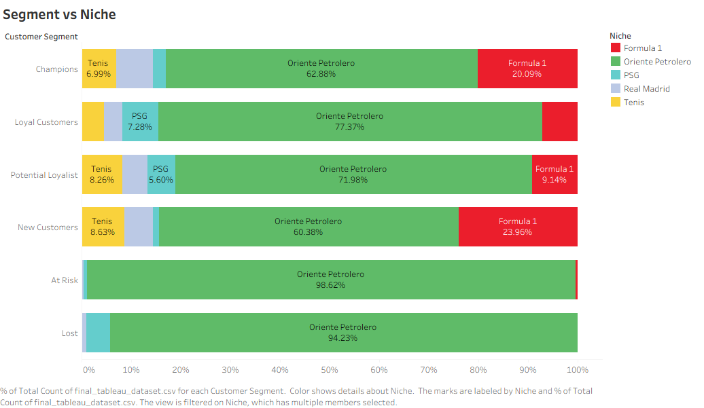
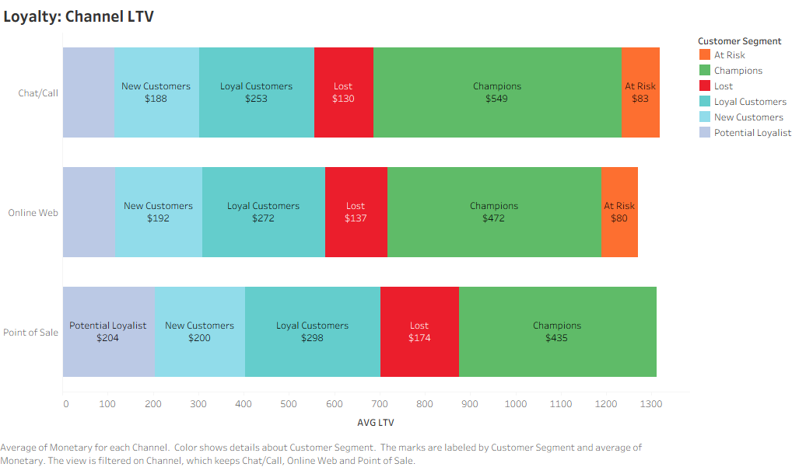
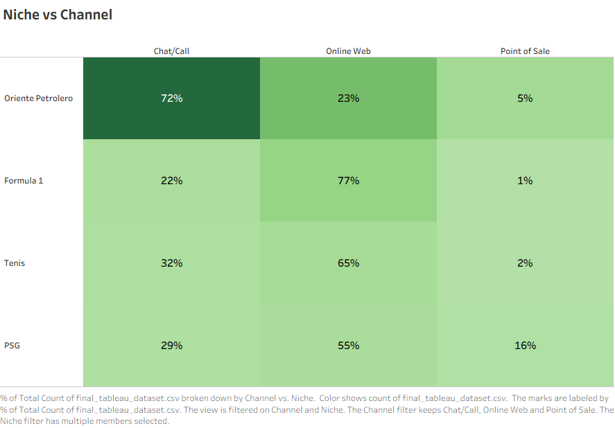
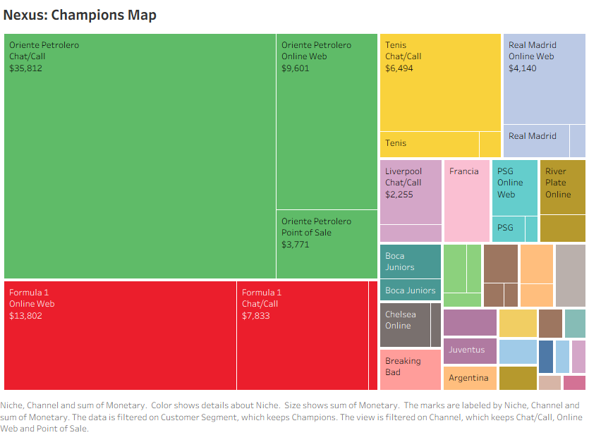
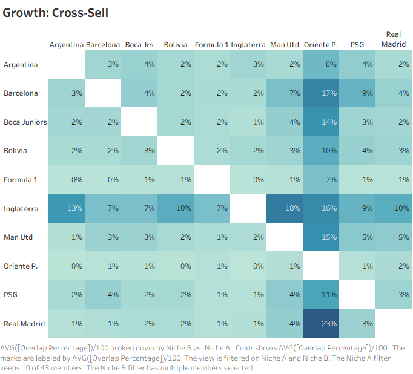

# Executive Report: Customer Equity Audit & Niche Strategy

**Client:** Rabbona Group | **Period:** 2018 - 2023

## 1. The Business Problem

The Rabbona Group operates a complex ecosystem of 4 distinct brands (**Oriente Petrolero, Rabbona, Victus, Nebula**) supported by an **Agile In-House Manufacturing Hub**.
**The Challenge:** The business has grown from a purely digital operation to a **Hybrid Retail System** (Physical Store + E-commerce). While production architecture was agile, the marketing budget allocation was fundamentally flawed—optimized for raw **Volume** (Cost per Acquisition) rather than actual **Customer Value** (Lifetime Value). This created hidden margin leaks where low-retention, high-volume niches were over-funded while the most profitable segments were neglected.

## 2. The Solution: Customer Equity Audit

We unified data from all 4 WooCommerce stores into a single Analytical Engine to audit the business across three dimensions:

1. **Niche Affinity:** Moving beyond "Products" to "Passions" (F1, Football, Pop Culture).
2. **Channel Loyalty:** Evaluating the ROI of the "High Touch" **Chat Channel (WhatsApp, FB Messenger, IG DM, TikTok DM)** against standard Web Checkout.
3. **RFM Segmentation:** Mathematically identifying "Champions" (High Lifetime Value).

---

## 3. Key Findings & Strategic Insights

### 1. Niche Quality: Acquisition vs. Loyalty

*(Tableau Sheet: Segment distribution across the top niches)*

* **Insight:** Formula 1 (Victus) and global clubs (Rabbona) drive a massive volume of new traffic and customer acquisition, but the vast majority make a single purchase. On the other hand, the Oriente Petrolero base (local club) retains its customers long-term.
* **Strategic Action:** Aggressively increase the "Launch Cadence" for F1 and global clubs to try converting one-time buyers into repeat customers via automated email/SMS flows, while treating the local club (OP) as a VIP retention program.

### 2. The Champion Distribution: The Engine of Profit

*(Tableau Sheet: Customer segments breakdown by top niche)*

* **Insight:** Despite high sales volumes from global clubs, a single local club brand (Oriente Petrolero) concentrates almost 50% of **all** Champion customers in the entire group. This local base provides the real Lifetime Value (LTV).
* **Strategic Action:** Protect this local base at all costs. Direct marketing budget not just to acquiring new OP fans, but investing heavily in loyalty and re-engagement campaigns (exclusive drops, VIP access) to ensure they remain the profitable anchor of the business.

### 3. Channel Audit: The ROI of Assisted Sales

*(Tableau Sheet: LTV and Champion concentration by acquisition channel)*

* **Insight:** The assumption that 100% self-serve web sales are optimal is dangerous. Customers who purchase via Chat (assisted sales) generate **3x more value (LTV)** and have a 28% conversion rate to Champions, compared to a mere 1.2% on the Web.
* **Strategic Action:** Maintain and scale the chat sales team. Treat Chat not merely as "customer support" but as the premium closing channel for high-ticket and high-LTV customers.

### 4. The Tactical Baseline: Channel Preference by Niche

*(Tableau Sheet: Purchase channel preference across different niches)*

* **Insight:** Niches dictate the channel preference. Fans of global football or F1 trust the web and prefer self-service checkout. Conversely, local club fans (Oriente Petrolero) strongly prefer the warmth and trust of chat or POS transactions.
* **Strategic Action:** Distribute the monthly ads and marketing budget accordingly. Run WhatsApp/Message campaigns for PA (which are significantly cheaper than web conversion campaigns), and invest heavily in Web Conversion optimization/campaigns for the F1 and Tennis audiences.

### 5. The Triple Nexus: Targeting Profiles

*(Tableau Sheet: The intersection of Niche, Segment, and Channel)*

* **Insight:** There are two distinct "Golden Profiles". Profile 1: *The Traditionalist* (Oriente Petrolero + Chat = High emotional LTV). Profile 2: *The Modern Fan* (F1/Global Clubs + Web = High transactional volume).
* **Strategic Action:** Implement a bifurcated omnichannel marketing strategy. Allocate budget to VIP Outbound targeting for Profile 1, and allocate performance marketing budget (TikTok Ads, SMS) for Profile 2.

### 6. The Growth Engine: Cross-Sell Matrix

*(Tableau Sheet: Visual network of high-probability cross-sell paths)*

* **Insight:** Purchase overlaps are not random; they follow strong cultural affinities. For example: Nationality + Club (England & Man United cluster at 33%), and Latam Pride (Oriente Petrolero buyers have a 35.2% probability of buying Real Madrid products).
* **Strategic Action:** Leverage these specific audiences to build cross-sell campaigns across Email Marketing, Meta Ads, and TikTok Ads. If a customer buys an OP product, immediately launch targeted ads and email flows offering them Real Madrid products, capitalizing on the proven high correlation.
