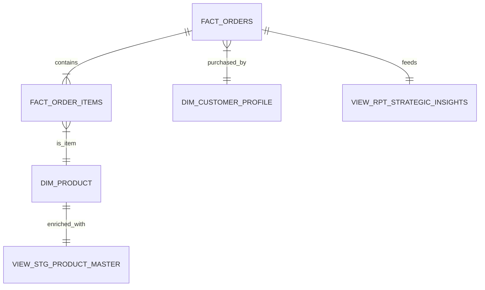

# Technical Approach: Customer Equity Audit

## 1. Data Architecture (The "Ecosystem")
The project consolidates data from 4 isolated WooCommerce instances into a centralized Analytical Engine.

### Schema Design (Star Schema)
*   **Fact Tables:** `fact_orders` (Header), `fact_order_items` (Line Level).
*   **Dimension Tables:** `dim_customer_profile`, `dim_product`, `dim_store`.
*   **Analytical Views:** Layered SQL views to abstract complexity.



## 2. SQL Engineering Strategy

### A. Data Unification & Cleaning
*   **Challenge:** Product names were inconsistent (e.g., "Camiseta Oriente" vs "Pera Oriente 2022").
*   **Solution:** Created `view_stg_product_master` using SQL CASE statements to map 500+ SKUs to stabilized "Niche Terms" (e.g., 'Oriente Petrolero', 'Formula 1', 'Anime').

### B. RFM Segmentation Engine
Instead of arbitrary thresholds, we used **Statistical Ranking** to ensure the model adapts to data changes.

```sql
-- Snippet from view_fct_customer_segmentation.sql
NTILE(5) OVER (ORDER BY last_order_date ASC) as r_score,
NTILE(5) OVER (ORDER BY frequencies ASC) as f_score,
NTILE(5) OVER (ORDER BY monetary ASC) as m_score
```

### C. The "Strategic Nexus" View
We created a final flattened view (`view_rpt_strategic_insights`) that pre-calculates the correlations for the visualization layer, ensuring Tableau performance is optimized (extracts < 500ms).

## 3. Tech Stack
*   **Database:** MariaDB (Remote VPS).
*   **ETL:** Node.js (Custom scripts for JSON parsing and data loading).
*   **Analysis:** Advanced SQL (Window Functions, CTEs).
*   **Visualization:** Tableau Desktop (Dual-Axis Charts, LOD Expressions).
